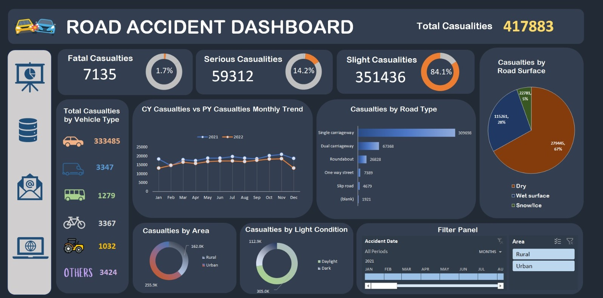

# 🚗 Road Accident Dashboard

An interactive dashboard that analyzes road accident casualty data to identify accident patterns, casualty severity, and environmental factors affecting road safety.

This project demonstrates data cleaning, KPI reporting, Pivot Table analysis, and dashboard development using Microsoft Excel.

---

## 🧠 Overview

This project analyzes road accident casualty data to uncover trends and factors contributing to road accidents. The dashboard provides insights into casualty severity, vehicle types, road conditions, road types, lighting conditions, and monthly accident trends.

The objective is to support data-driven decision-making for improving road safety, identifying high-risk conditions, and assisting authorities in developing effective accident prevention strategies.

---

## 🎯 Business Questions

- What is the total number of road accident casualties?
- Which casualty severity contributes the highest number of cases?
- Which vehicle types are involved in the most casualties?
- How do road type, road surface, and lighting conditions affect casualty numbers?
- What are the monthly casualty trends between 2021 and 2022?
- Which areas (Urban or Rural) experience more casualties?

---

## 🛠️ Tools & Technologies

- Microsoft Excel
- Pivot Tables
- Dashboard Design
- Data Cleaning
- Data Transformation
- Excel Formulas
- KPI Calculations
- Slicers & Timeline Filters

---

## 📂 Dataset Overview

- **Source:** Road Accident Dataset
- **Records:** 417,883 casualty records
- **Period:** 2021–2022
- **Format:** CSV

### 📌 Features

- Accident Date
- Casualty Severity
- Vehicle Type
- Road Type
- Road Surface Condition
- Light Condition
- Urban/Rural Area
- Number of Casualties

> ⚠️ This project is intended for educational and portfolio purposes only.

---

## 🧹 Data Preparation

- Cleaned and validated accident records
- Grouped vehicle categories using PivotTable Calculated Items
- Combined road surface categories into **Dry**, **Wet Surface**, and **Snow/Ice**
- Consolidated lighting conditions into **Daylight** and **Dark**
- Created KPI metrics for casualty severity
- Built Pivot Tables for dashboard reporting
- Developed an interactive dashboard using Slicers and Timeline Filters

---

## 📊 Dashboard Preview

---

## 📁 Interactive Dashboard

👉 **Download the Excel Dashboard**

[(./ROAD%20ACCIDENT%20DASHBOARD.xlsb)](https://drive.google.com/file/d/1YnqLgEW9lLdZKCWGo46dSSSEFEsVOnAo/view)

---

## 📈 Key Insights

- Total casualties recorded: **417,883**
- **Slight** casualties account for **84.1%** of all reported cases.
- **Cars** are involved in the highest number of casualties.
- **Single carriageways** record the highest casualty count among all road types.
- Most accidents occur on **dry road surfaces**.
- **Urban areas** record significantly more casualties than rural areas.
- Most casualties occur during **daylight conditions**.
- Casualty numbers generally increase towards **October** and **November** before declining in **December**.

---

## 💡 Business Recommendations

- Prioritize road safety improvements on **single carriageways**.
- Increase road safety awareness campaigns targeting **car drivers**.
- Strengthen enforcement during peak accident months.
- Improve traffic management in **urban areas**.
- Enhance driver awareness even during **dry weather**, where most accidents occur.
- Continue improving road infrastructure and lighting to reduce accident severity.

---

## 🚀 Skills Demonstrated

- Data Cleaning
- Data Transformation
- Pivot Tables
- Dashboard Development
- Data Visualization
- KPI Reporting
- Business Analysis
- Microsoft Excel

---

## 🚀 Project Impact

This dashboard enables stakeholders to:

- Monitor road accident trends
- Identify high-risk road conditions
- Analyze casualty severity
- Support evidence-based road safety planning
- Improve traffic management strategies

---

## 📬 Contact

**Adibatunnailah Abdul Razak**

📧 Email: dibarazak2@gmail.com

💼 LinkedIn: https://www.linkedin.com/in/adibatunnailah
